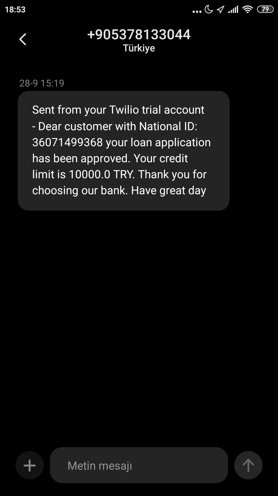

[![LinkedIn][linkedin-shield]][linkedin-url]
[![JDK][jdk-shield]][jdk-url]


<br />
<p align="center">
  <a href="https://github.com/113-GittiGidiyor-Java-Spring-Bootcamp/gittigidiyor-graduation-project-ctemelkuran">
    
  </a>
 </p>
<h3 align="center">Loan Application System</h3>

  <p align="center">
    This project is the graduation project for GittiGidiyor Java Spring Bootcamp.
    <br />
    <a href="https://github.com/113-GittiGidiyor-Java-Spring-Bootcamp/gittigidiyor-graduation-project-ctemelkuran"><strong>Explore the docs »</strong></a>
    <br />
    <br />
    <a href="https://github.com/113-GittiGidiyor-Java-Spring-Bootcamp/gittigidiyor-graduation-project-ctemelkuran">View Demo</a>
    ·
    <a href="https://github.com/113-GittiGidiyor-Java-Spring-Bootcamp/gittigidiyor-graduation-project-ctemelkuran/issues">Report Bug</a>
      
  </p>


<!-- TABLE OF CONTENTS -->
<details open="open">
  <summary><h2 style="display: inline-block">Table of Contents</h2></summary>
  <ol>
    <li>
      <a href="#about-the-project">About The Project</a>
      <ul>
        <li><a href="#built-with">Built With</a></li>
      </ul>
    </li>
    <li>
      <a href="#getting-started">Getting Started</a>
      <ul>
        <li><a href="#prerequisites">Prerequisites</a></li>
        <li><a href="#installation">Installation</a></li>
      </ul>
    </li>
    <li><a href="#usage">Usage</a></li>
    <li><a href="#license">License</a></li>
    <li><a href="#contact">Contact</a></li>
  </ol>
</details>


## About The Project


Loan application system is a demo which customers can apply for credit.
It is developed as the graduation project for the 
GittiGidiyor Java Spring BootCamp which is led by our beloved 
instructor [Koray Güney](https://github.com/korayguney).

### Built With

* [Spring](https://spring.io/)
* [H2 Database](https://www.h2database.com/)
* [MongoDB](https://www.mongodb.com/)

### Sms Service

If the customer applies for loan, a result sms is sent to their phone number.


<p align="center">
  <a>
    
  </a>
 </p>


## Getting Started

To get a local copy up and running follow these simple steps.

### Prerequisites


* [Install JDK 8](https://www.oracle.com/java/technologies/downloads/) or an upper version.
* [Install Docker Desktop](https://www.docker.com/products/docker-desktop) to create Mongo DB containers.


### Installation

1. Clone the repo
   ```sh
   git clone https://github.com/113-GittiGidiyor-Java-Spring-Bootcamp/gittigidiyor-graduation-project-ctemelkuran.git
   ```
2. Change directory to `credit-score-system` and run the command below to set up Mongo DB.
   ```sh
   docker-compose -f docker-compose.yaml up -d
   ```
3. Modules can be run by navigating to their directory and executing the following command.
   ```sh
   mvnw spring-boot:run
   ```
4. After running `credit-score-system` Mongo DB will be running on `http://localhost:8081`
5. `loan-application-system` app will be running on `http://localhost:8080`

<!-- USAGE EXAMPLES -->
## Usage

[Swagger UI](https://swagger.io/tools/swagger-ui/) configurations are made for this application.
API's visualised interface can be reach from http://localhost:8080/swagger-ui.html 

### Documentations for End Points
**Loan Application**
* [Apply To Loan](docs/loan-application/apply-to-loan.md)
* [Show Loan Application Result](docs/loan-application/get-loan-application-result.md)

**Operations on Customers**
* [Show All Customer](docs/customer/get-all-customers.md)
* [Save New Customer](docs/customer/save-customer.md)
* [Update Customer](docs/customer/update-customer.md)
* [Delete Customer](docs/customer/delete-customer.md)

**Loan Application and Exception Logs**
* [Show Application Logs By Date](docs/customer/get-application-logs.md)
* [Show Exception Logs By Date](docs/exception-logs/get-exception-logs-by-date.md)
* [Show Exception Logs By Type](docs/exception-logs/get-exception-logs-by-type.md)


### Access Databases

**View H2 Database**

The project runs on H2 in-memory database. To view and interact with the database
http://localhost:8080/h2-console can be browsed. You can login with the default username 'sa' and blank password. 

**View MongoDB** 

Credit score service runs on Mongo DB containers. 
To view and interact with the database http://localhost:8081 can be browsed after running up `docker-compose.yaml` on Docker engine.

### Spring Boot Actuator

With the help of [Spring Boot Actuator](https://docs.spring.io/spring-boot/docs/current/reference/html/actuator.html) the
application can be managed and monitored by using HTTP endpoints. Health and metrics can be audited.
After browsing http://localhost:8080/actuator the following end points can be helpful to monitor the service.

`/health` Shows application health information.

`/metrics` Shows metrics of the running application.

`/env` Exposes properties from Spring’s `ConfigurableEnvironment`.


## Roadmap

A useful front-end could be developed for the project. 
Also, there must be many security vulnerability that can be reduced.


## License

Distributed under the MIT License. See [LISENCE](LICENSE) for more information.


<!-- CONTACT -->
## Contact

Çığır Temelkuran - [@cigirtemelkuran](https://twitter.com/cigirtemelkuran) - ctemelkuran@gmail.com

Project Link: [https://github.com/113-GittiGidiyor-Java-Spring-Bootcamp/gittigidiyor-graduation-project-ctemelkuran](https://github.com/113-GittiGidiyor-Java-Spring-Bootcamp/gittigidiyor-graduation-project-ctemelkuran)


[stars-shield]: https://img.shields.io/github/stars/ctemelkuran/repo.svg?style=for-the-badge
[stars-url]: https://github.com/113-GittiGidiyor-Java-Spring-Bootcamp/gittigidiyor-graduation-project-ctemelkuran/stargazers
[license-shield]: https://img.shields.io/github/license/ctemelkuran/repo.svg?style=for-the-badge
[license-url]: https://github.com/113-GittiGidiyor-Java-Spring-Bootcamp/gittigidiyor-graduation-project-ctemelkuran/blob/main/LICENSE
[linkedin-shield]: https://img.shields.io/badge/-LinkedIn-black.svg?style=for-the-badge&logo=linkedin&colorB=555
[linkedin-url]: https://linkedin.com/in/ctemelkuran
[size-shield]: https://img.shields.io/github/repo-size/113-GittiGidiyor-Java-Spring-Bootcamp/gittigidiyor-graduation-project-ctemelkuran?style=for-the-badge
[size-url]: https://img.shields.io/github/repo-size/113-GittiGidiyor-Java-Spring-Bootcamp/gittigidiyor-graduation-project-ctemelkuran?style=for-the-badge
[jdk-url]: https://www.oracle.com/java/technologies/downloads/
[jdk-shield]: https://img.shields.io/badge/JDK-%3E%3D8-red?style=for-the-badge&logo=appveyor
